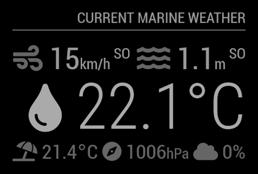

# Module: MMM-MarineWeather
This module displays the current marine weather, including the water temperature, the air temperature, the current wind conditions (speed and direction) and current wave conditions (height, direction and period).

The wave period display may be enabled or disabled. 

<p align="left">



</p>

[MagicMirror Project on Github](https://github.com/MichMich/MagicMirror) | [StormGlass](https://stormglass.io/)

## Installation:

In your terminal, go to your MagicMirror's Module folder:

```shell
cd ~/MagicMirror/modules
```
Clone this repository:
```shell
git clone https://github.com/grenagit/MMM-MarineWeather
```

Configure the module in your config.js file.

## Update:

In your terminal, go to your MMM-MarineWeather's Module folder:

```shell
cd ~/MagicMirror/modules/MMM-MarineWeather
```
Incorporate changes from this repository:
```shell
git pull
```

## Configuration:

### Basic configuration

To use this module, add it to the modules array in the `config/config.js` file:
```javascript
modules: [
	{
		module: "MMM-MarineWeather",
		position: "top_right",
		config: {
			latitude: 0, // Latitude 
			longitude: 0, // Longitude
			appid: "abcde12345abcde12345abcde12345ab" // StormGlass API key (docs.stormglass.io)
		}
	}
]
```

You can use the special `414492aa-c717-11e9-a3da-0242ac130004-4144953e-c717-11e9-a3da-0242ac130004` API Key for your tests but it has much lower rate limits !

### Options

The following properties can be configured:


| Option                       | Description
| ---------------------------- | -----------
| `latitude`                   | The latitude of the desired point <br><br>  This value is **REQUIRED**
| `longitude`                  | The longitude of the desired point <br><br>  This value is **REQUIRED**
| `appid`                      | The [StormGlass](https://docs.stormglass.io) API key, which can be obtained by [signing up](https://dashboard.stormglass.io/register) on StormGlass portal. It's free for 50 requests per day! <br><br>  This value is **REQUIRED**
| `units`                      | What units to use. Specified by config.js <br><br> **Possible values:** `config.units` = Specified by config.js, `metric` = Celsius, `imperial` = Fahrenheit <br> **Default value:** `config.units`
| `updateInterval`             | How often does the content needs to be fetched? (Milliseconds) <br><br> **Possible values:** `1000` - `86400000` <br> **Default value:** `60 * 60 * 1000` (1 hour)
| `animationSpeed`             | Speed of the update animation. (Milliseconds) <br><br> **Possible values:**`0` - `5000` <br> **Default value:** `1000` (1 second)
| `showWindDirectionAsArrow`   | Show the wind direction as an arrow instead of abbreviation <br><br> **Possible values:** `true` or `false` <br> **Default value:** `false`
| `showWavePeriod`   	       | Show the wave period <br><br> **Possible values:** `true` or `false` <br> **Default value:** `false`
| `useBeaufort`                | Use the Beaufort scale for wind speed and wave speed or using the default units. <br><br> **Possible values:** `true` or `false` <br> **Default value:** `false`
| `useKMPH`                    | Use KMPH as units for wind speed. <br><br> **Possible values:**`true` or `false`<br>**Default value:** `true`
| `roundTemp`                  | Round temperature value to nearest integer. <br><br> **Possible values:** `true` (round to integer) or `false` (display exact value with decimal point) <br> **Default value:** `false`
| `initialLoadDelay`           | The initial delay before loading. If you have multiple modules that use the same API key, you might want to delay one of the requests. (Milliseconds) <br><br> **Possible values:** `1000` - `5000` <br> **Default value:**  `0`
| `retryDelay`                 | The delay before retrying after a request failure. (Milliseconds) <br><br> **Possible values:** `1000` - `60000` <br> **Default value:**  `2500` (2,5 seconds)
| `apiBase`                    | The StormGlass API base URL. <br><br> **Default value:**  `'https://api.stormglass.io/'`
| `apodEndpoint`	       | The StormGlass API endPoint. <br><br> **Default value:**  `'v1/weather/point'`
| `params`                     | The comma separeted list of params for the StormGlass API response. <br><br> **Default value:**  `'airTemperature,waterTemperature,windSpeed,windDirection,waveHeight,waveDirection,wavePeriod'`
| `dataSource`	       	       | The StormGlass API information [source](https://docs.stormglass.io/#sources). <br><br> **Possible values:** `'sg'` or `'noaa'` <br> **Default value:**  `'sg'` (StormGlass).

### Todo

- [ ] Add a coloured legend depending on the water temperature
- [x] Convert data to the selected unit system with config.units
- [x] Add the Air temperature

### License

This module is licensed under the MIT License
